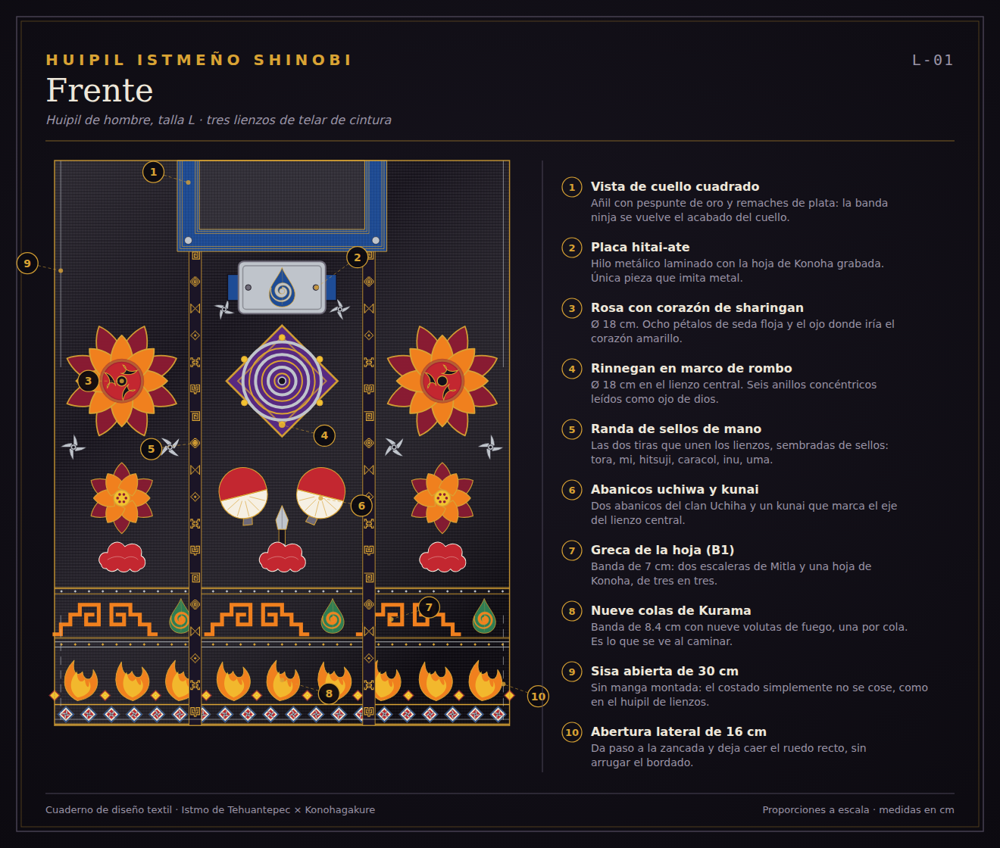
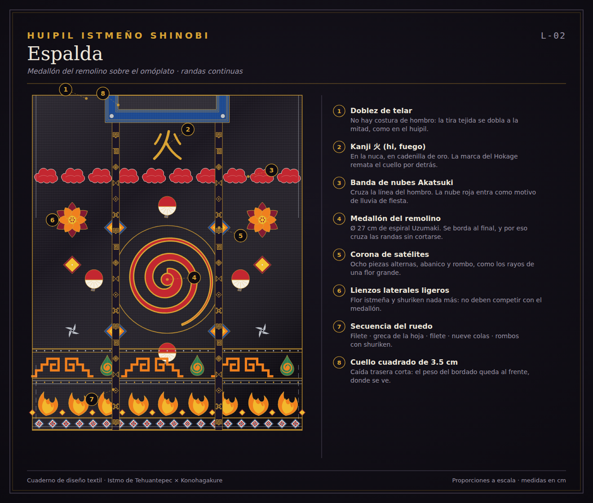
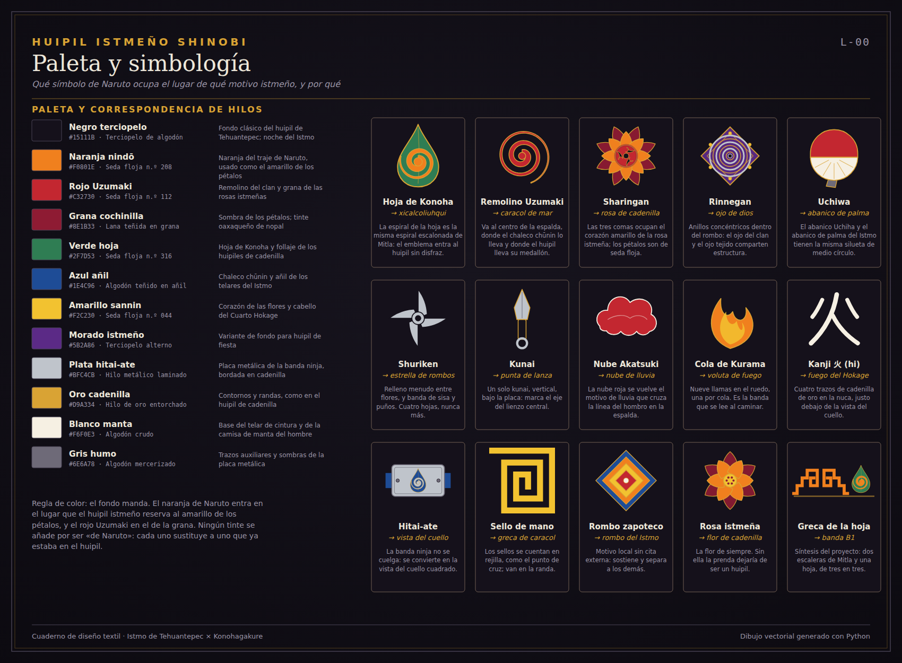
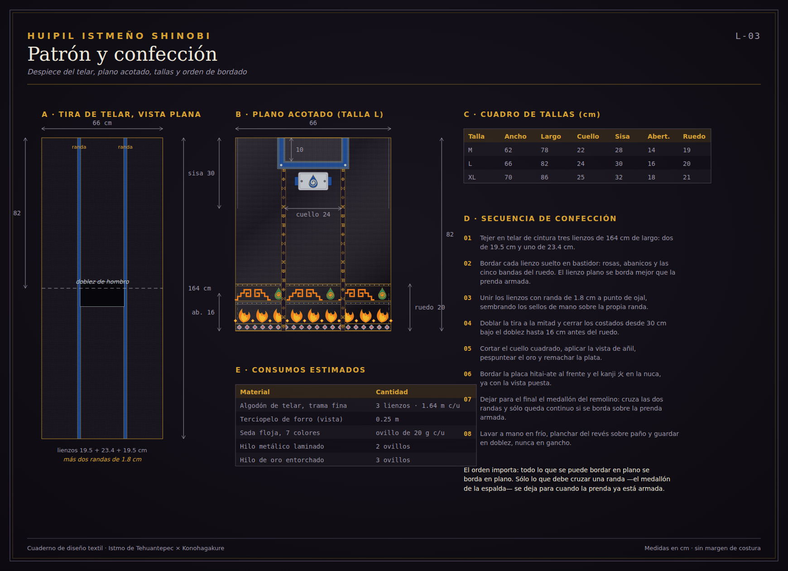
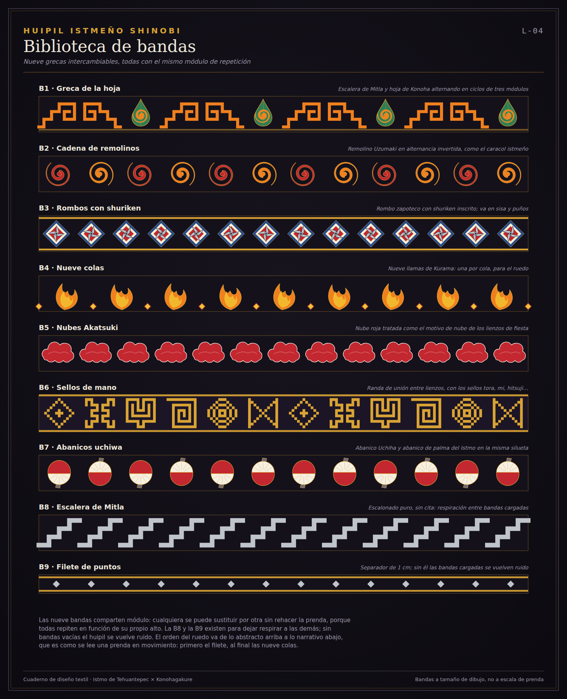
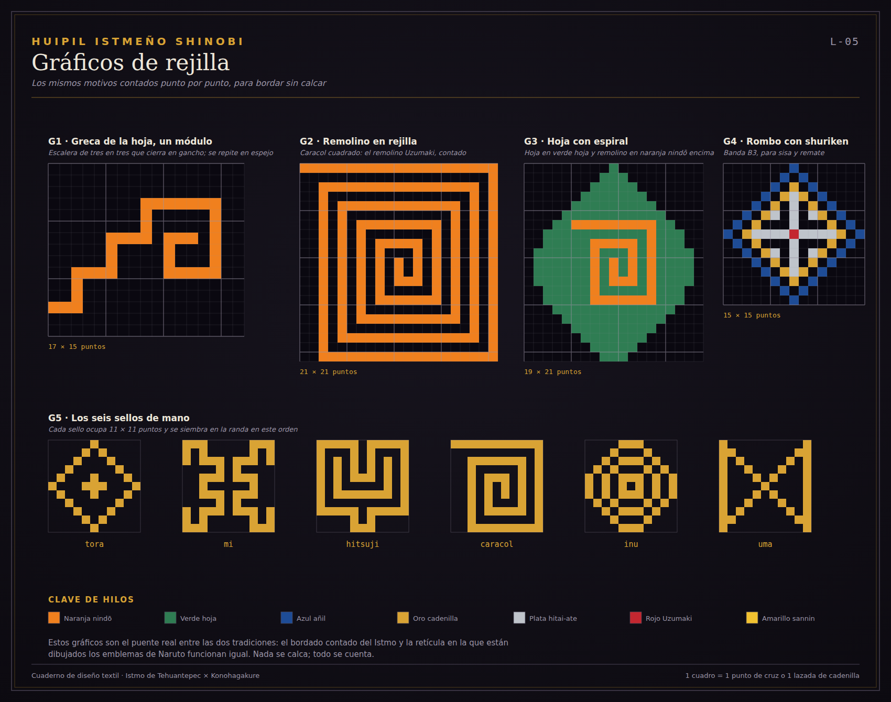
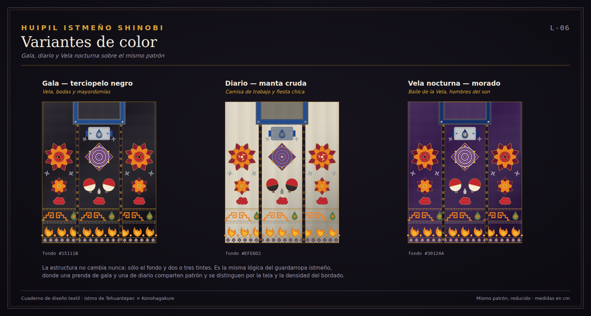

# Huipil istmeño shinobi

Cuaderno de diseño de un **huipil de hombre del Istmo de Tehuantepec, Oaxaca**,
bordado con la iconografía de *Naruto*.

No es una camiseta con estampado de anime. La regla de todo el proyecto es una
sola: **los símbolos de Naruto entran a la gramática del bordado istmeño, y no al
revés**. Cada emblema ocupa el lugar que un motivo zapoteco ya tenía en la prenda,
y se somete a sus mismas leyes —simetría, repetición en banda, contorno de
cadenilla, relleno plano de seda floja y cuenta de hilos—. Si un motivo no cabe en
esas leyes, no entra.

El hallazgo que hace posible la pieza es que ya existía un puente formal: la
**espiral**. El remolino Uzumaki y el *xicalcoliuhqui* —la greca escalonada de
Mitla— son el mismo gesto resuelto por dos culturas distintas. Todo lo demás
cuelga de ahí.

## Las siete láminas

| Lámina | Contenido |
| --- | --- |
| [L-00](laminas/L-00-paleta-y-simbologia.svg) | Paleta de hilos y simbología: qué símbolo ocupa el lugar de qué motivo, y por qué |
| [L-01](laminas/L-01-frente.svg) | Vista de frente, con las diez zonas de bordado acotadas |
| [L-02](laminas/L-02-espalda.svg) | Vista de espalda: medallón del remolino sobre el omóplato |
| [L-03](laminas/L-03-patron-y-confeccion.svg) | Despiece del telar, plano acotado, cuadro de tallas y orden de bordado |
| [L-04](laminas/L-04-biblioteca-de-bandas.svg) | Nueve grecas intercambiables con el mismo módulo de repetición |
| [L-05](laminas/L-05-graficos-de-rejilla.svg) | Los motivos contados punto por punto, para bordar sin calcar |
| [L-06](laminas/L-06-variantes-de-color.svg) | Tres variantes de color sobre el mismo patrón |

### Frente



### Espalda



### Paleta y simbología



### Patrón y confección



### Biblioteca de bandas



### Gráficos de rejilla



### Variantes de color



## La prenda, en breve

Huipil recto de hombre, talla L: **66 cm de ancho plano por 82 cm de largo**,
armado con **tres lienzos de telar de cintura** (19.5 + 23.4 + 19.5 cm) unidos por
**dos randas de 1.8 cm**. La tira se teje de corrido —164 cm— y se dobla por el
hombro, así que no hay costura de hombro. Cuello cuadrado de 24 cm, sisa abierta
de 30 cm sin manga montada y abertura lateral de 16 cm en el ruedo.

Catorce motivos, repartidos por registros horizontales al frente y a la espalda:

- **Vista del cuello** = banda ninja (*hitai-ate*), con la placa metálica bordada en hilo laminado.
- **Pechera** = dos rosas de cadenilla con corazón de *sharingan* y un *rinnegan* leído como ojo de dios.
- **Randas** = los seis sellos de mano contados en rejilla: *tora, mi, hitsuji*, caracol, *inu, uma*.
- **Espalda** = medallón del remolino Uzumaki de 27 cm, kanji 火 en la nuca y banda de nubes Akatsuki cruzando el hombro.
- **Ruedo** = cinco bandas apiladas, de lo abstracto arriba a lo narrativo abajo: las nueve colas de Kurama ocupan la más baja y ancha, con un remate de rombos.

El detalle del que más estoy convencido: el medallón de la espalda **cruza las dos
randas**. Eso obliga a bordarlo al final, sobre la prenda ya armada, y es
exactamente lo que hace una bordadora cuando un motivo tiene que quedar continuo.
Está anotado así en la secuencia de confección de la L-03.

## Cómo regenerar las láminas

Las láminas SVG son la fuente de verdad y se generan con Python, sin dependencias
externas:

```bash
python3 tools/generar_laminas.py            # escribe laminas/*.svg
./tools/rasterizar.sh                       # convierte a previews/*.png con Chrome
```

El rasterizado sólo existe para que el README se vea en GitHub; para imprimir o
bordar, usa los SVG.

```
tools/huipil/paleta.py     tintes, correspondencia de hilos y variantes de color
tools/huipil/motivos.py    los dieciséis motivos y las nueve bandas
tools/huipil/prenda.py     geometría de la prenda y composición de cada vista
tools/huipil/laminas.py    armado de las siete láminas
tools/huipil/svg.py        utilidades de SVG
```

Todo el dibujo de la prenda está en centímetros: quien compone la lámina
multiplica por la escala. Cambiar una medida en `TALLAS` recoloca los bordados y
las cotas solos.

## Más lectura

- [Memoria de diseño](docs/MEMORIA-DE-DISENO.md) — las decisiones y por qué, incluidas las que descarté.
- [Simbología](docs/SIMBOLOGIA.md) — tabla completa de correspondencias, motivo por motivo.
- [Nota cultural y de derechos](docs/NOTA-CULTURAL.md) — por qué un huipil de hombre, y qué no se puede hacer con esto.
