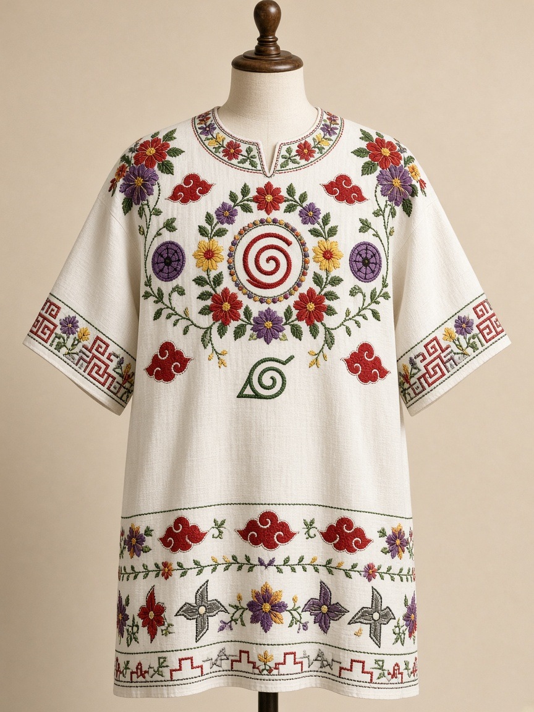
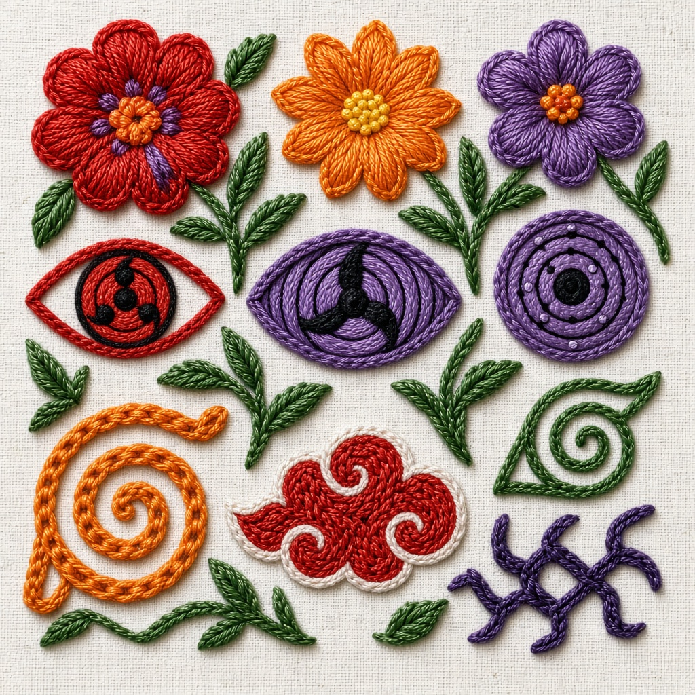
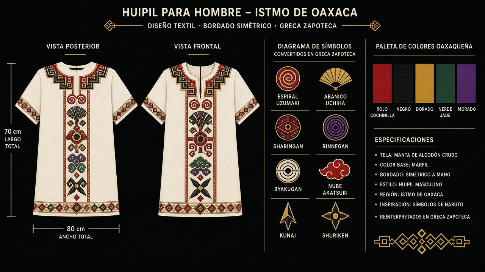

# Huipil para Hombre del Istmo de Oaxaca × Naruto — Diseño "Guerrero Istmeño Shinobi"

## 1. Concepto
Fusión respetuosa de dos tradiciones guerreras y festivas:
- **Base:** Huipil istmeño masculino (Tehuantepec, Juchitán): camisa suelta de manta color marfil, corte recto, manga corta amplia, cuello redondo bordado. A diferencia del huipil femenino de terciopelo, el masculino es sobrio para uso diario/fiesta, bordado solo en cuello, pechera en "V" y puños.
- **Intervención Naruto:** Los símbolos del anime se reinterpretan como si fueran flores, grecas y sellos zapotecos, bordados en cadenilla istmeña (no estampado).

Nombre del diseño: **"Neza Shinobi"** — *neza* = camino en zapoteco del Istmo + *shinobi* (忍).

## 2. Vistas del diseño

### Vista frontal completa

### Detalle macro de bordado

### Ficha técnica / espalda y simbología

## 3. Mapa de símbolos — dónde va cada signo de Naruto

Todo bordado a mano, hilo de seda / artisela. Nada impreso.

**Pecho (lienzo central, el más importante):**
- **Espiral Uzumaki (渦巻)** al centro, en naranja + rojo cochinilla, de 12 cm. Sustituye a la flor central istmeña. Representa el remolino, como los remolinos del viento istmeño (el famoso viento Tehuanero).
- Alrededor: corona de **flores istmeñas** rojas, amarillas y moradas. Entre pétalos se esconden 3 **Sharingan** rojos pequeños (3 tomoes) como si fueran centros de flor.
- Debajo: **Hoja de Konoha** bordada en verde jade, del tamaño de una palma, como "hoja santa".

**Cuello redondo:**
- Cenefa de **nubes Akatsuki** rojas intercaladas con enredaderas verdes istmeñas. La nube se alarga para parecer flor de cempasúchil vista de lado.
- Remate con puntada de ojal negro.

**Hombros / mangas:**
- Izquierdo: **Abanico Uchiha** (blanco y rojo) dentro de un sol istmeño bordado en dorado.
- Derecho: **Rinnegan morado + Byakugan blanco** como par de ojos gemelos, rodeados de pétalos.
- Puños: greca zapoteca en escalera (xicalcoliuhqui) pero cada escalón termina en punta de **shuriken / kunai** estilizado en hilo negro y plata.

**Espalda:**
- **Sello del Cuarto Hokage / Sello de los 4 símbolos** reinterpretado como mandala circular de 20 cm, con kanjis simplificados + grecas. Arriba: luna + **Mangekyō Sharingan** de Itachi/Sasuke como sol y luna istmeños.
- Abajo del cuello: pequeña **rana de Jiraiya / Monte Myōboku** en verde, homenaje a la fauna del Istmo (iguanas, ranas).

**Faldón inferior:**
- Cenefa corrida de grecas zapotecas negras + pequeñas **nubes Akatsuki** rojas cada 10 cm.

## 4. Paleta de color (doble significado)

| Hilo | Istmo | Naruto |
|------|-------|--------|
| Rojo cochinilla #A31621 | Flor de cempasúchil, sangre festiva | Nube Akatsuki, Sharingan |
| Naranja cempasúchil #E67E22 | Fiesta, bordado Tehuana | Traje de Naruto, espiral Uzumaki |
| Morado #6C3483 | Luto-fiesta, terciopelo | Rinnegan, chakra maldito |
| Verde jade #1E8449 | Milpa, enredadera | Hoja de Konoha, chakra |
| Dorado / Amarillo #D4AC0D | Sol istmeño, oro | Chakra Kyūbi (Zorro 9 colas) |
| Negro #111111 | Greca zapoteca, luto | Sello, kunai |
| Marfil manta #F5EBD7 | Base algodón | Pergamino ninja |

## 5. Materiales y técnica tradicional

- **Lienzo:** manta de algodón 100% color marfil, 3 lienzos cosidos (como huipil auténtico), no poliéster.
- **Bordado:** cadenilla con gancho (técnica istmeña), hilo artisela/seda. Puntadas: cadenilla, satín para ojos, ojal para contornos.
- **Corte hombre:** recto, largo a media cadera (70-75 cm), manga corta a 25 cm del hombro con abertura lateral de 15 cm. Cuello redondo de 18 cm diámetro con refuerzo.
- **Tallas:** S/M/L/XL. El bordado no debe picar: forro de popelina en cuello por dentro.

## 6. Cómo pedirlo a una artesana / sastre istmeño

1. Lleva estas 3 imágenes + este documento.
2. Pide "huipil de hombre en manta, bordado cadenilla, no terciopelo".
3. Pide que primero borden la espiral Uzumaki al centro y luego las flores alrededor, para que el tamaño quede equilibrado.
4. Los kanjis y ojos hazlos en satín pequeño (máx 5 cm) para que no se deformen al lavar.
5. Lava a mano, seca a la sombra. Plancha al revés.

## 7. Significado cultural (para usarlo con respeto)

No es un disfraz. Es un diálogo: el Istmo celebra la valentía, la fiesta y la identidad zapoteca; Naruto habla de perseverancia, clan y camino ninja (*nindō*). Ambos valoran la comunidad y el honor. Al usarlo, reconoce a las bordadoras istmeñas (Tehuanas, Juchitecas) como autoras.

> Sugerencia: si lo mandas a hacer, firma la pieza como co-creación: "Bordado por [nombre artesana], diseño Neza Shinobi".

---
*Diseño conceptual generado como propuesta visual. Los símbolos de Naruto pertenecen a Masashi Kishimoto / Shueisha. Uso propuesto solo artesanal, sin fines de producción masiva.*
