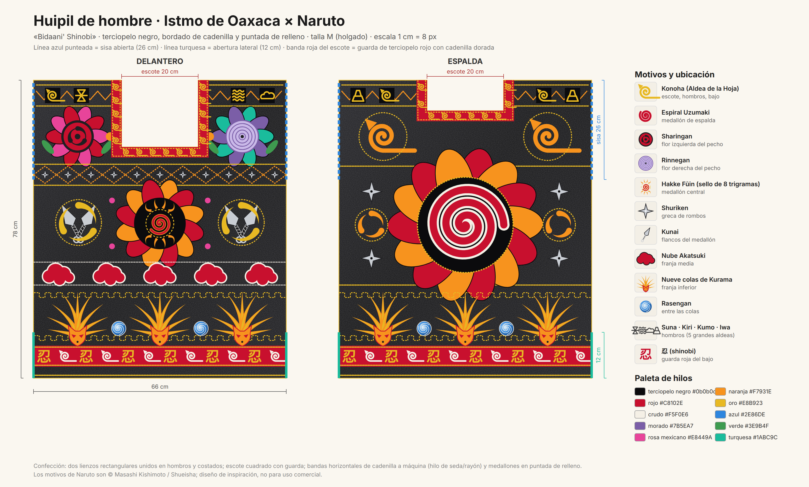
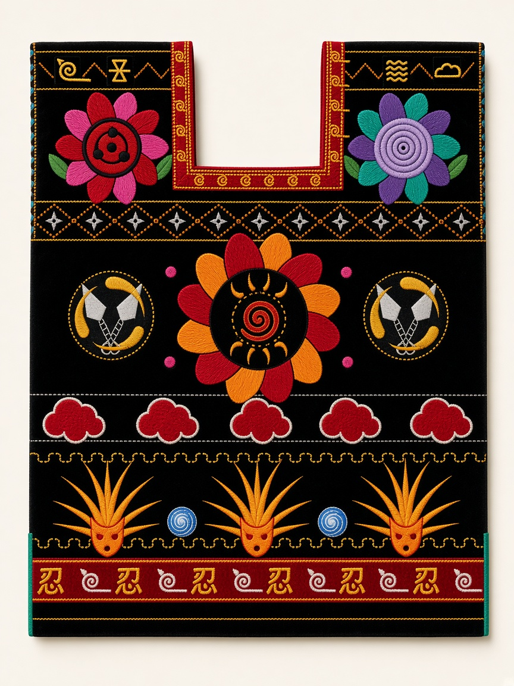
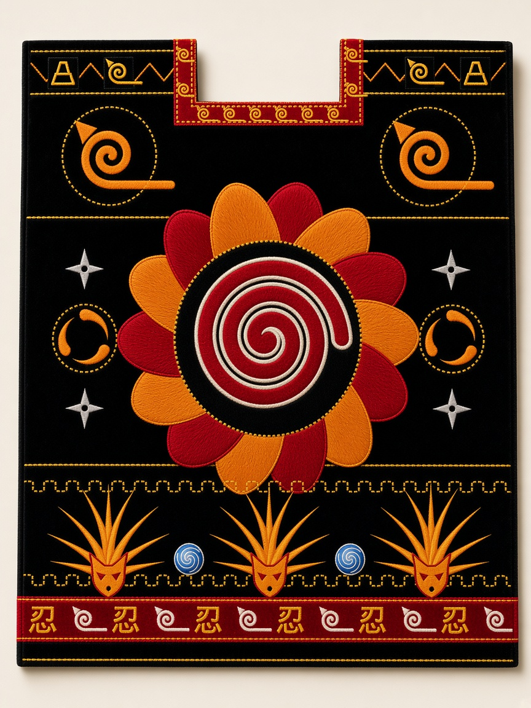

# Huipil de hombre · Istmo de Oaxaca × Naruto

**«Bidaani' Shinobi»** (*bidaani'* = huipil en zapoteco del Istmo)

Diseño de un huipil masculino inspirado en el huipil corto de Tehuantepec y
Juchitán —terciopelo negro, cadenilla a máquina en bandas horizontales y
grandes flores en puntada de relleno— sustituyendo la flora tradicional por
signos y símbolos del universo de *Naruto*.

| Archivo | Contenido |
|---|---|
| `huipil-istmo-naruto.svg` | Plano vectorial editable: delantero, espalda, cotas, leyenda de motivos y paleta. |
| `huipil-istmo-naruto.png` | Render del plano (3380 × 2040 px). |
| `generar_huipil.py` | Generador del SVG (Python 3, sin dependencias). Cambia colores, medidas o motivos y vuelve a ejecutarlo. |
| `ilustracion-delantero.jpg` / `ilustracion-espalda.jpg` | Ilustraciones de la prenda bordada (generadas con IA a partir del plano, como referencia visual de acabado). |

```bash
python3 generar_huipil.py   # escribe huipil-istmo-naruto.svg
```



| Delantero | Espalda |
|---|---|
|  |  |

---

## 1. Concepto

El huipil istmeño se construye con **lienzos rectangulares** de tela comercial
(no de telar de cintura), **escote cuadrado** con guarda, y una decoración que
alterna **franjas geométricas de cadenilla** (*la gradita*, *el cerrito*,
rombos, zigzag) con **medallones florales** de relleno. Esta propuesta respeta
esa estructura y traduce cada elemento:

| Elemento istmeño | Traducción Naruto |
|---|---|
| Flor grande de pecho (izquierda) | **Sharingan** como corazón de una flor de pétalos rosa mexicano y rojo, con hojas verdes |
| Flor grande de pecho (derecha) | **Rinnegan** como corazón de una flor turquesa y morada |
| Medallón central del torso | **Hakke no Fūin Shiki** (sello de ocho trigramas) con espiral Uzumaki, rodeado de pétalos naranja y rojo |
| Medallón de espalda | **Espiral Uzumaki** grande (como la espalda de la chamarra de Naruto), con pétalos rojo y naranja |
| Greca de rombos | Rombos de cadenilla naranja con **shuriken** en cada rombo |
| Greca "el cerrito" (zigzag de hombros) | Zigzag naranja con los símbolos de las **Cinco Grandes Aldeas** (Konoha, Suna, Kiri, Kumo, Iwa) en recuadros |
| Franja media | **Nubes de Akatsuki** (rojo con contorno crudo) entre dos líneas de cadenilla blanca |
| Franja inferior | **Nueve colas de Kurama** como abanicos de llamas naranja y oro —que recuerdan al maguey oaxaqueño— alternadas con **Rasengan** azules, entre dos *graditas* doradas |
| Guarda del bajo | Banda de terciopelo rojo con el kanji **忍** (*shinobi*) en oro alternado con el símbolo de **Konoha** en crudo |
| Guarda del escote | Terciopelo rojo con cadenilla dorada y una hilera de pequeños símbolos de **Konoha** |
| Flancos del medallón central | Pares de **kunai** cruzados sobre círculos de tres **tomoe** dorados |

Los *tomoe* (comas) del Sharingan se repiten sueltos como relleno, igual que
los capullos y hojitas en el huipil tradicional.

## 2. Paleta

| Uso | Color | Hex |
|---|---|---|
| Base (terciopelo) | negro | `#0b0b0d` |
| Cadenilla principal / colas / pétalos | naranja Naruto | `#F7931E` |
| Uzumaki, Akatsuki, Sharingan, guardas | rojo | `#C8102E` |
| Cadenilla fina, Konoha, kanji | oro | `#E8B923` |
| Contornos, Konoha del bajo, nubes | crudo | `#F5F0E6` |
| Rasengan, línea de sisa | azul | `#2E86DE` |
| Rinnegan | morado / lila | `#7B5EA7` / `#C9B8E8` |
| Hojas | verde | `#3E9B4F` |
| Pétalos del Sharingan, tomoe de relleno | rosa mexicano | `#E8449A` |
| Pétalos del Rinnegan, abertura lateral | turquesa | `#1ABC9C` |
| Shuriken y kunai | plata | `#C9CDD3` |

Hilos: rayón o seda brillante para la cadenilla (como en Juchitán); algodón
mercerizado o seda para el relleno de los medallones.

## 3. Patrón y medidas (talla M, corte holgado masculino)

```
      ┌────────┐ ← escote 20 × 17.5 cm (delantero) / 20 × 8 cm (espalda)
┌─────┘        └─────┐  ┐
│    sisa abierta    │  │ 26 cm (sin coser)
│                    │  ┘
│                    │
│   lienzo 66 × 78   │  78 cm
│                    │
│                    │  ┐
│ abertura lateral   │  │ 12 cm (sin coser)
└────────────────────┘  ┘
         66 cm
```

* **Dos lienzos** rectangulares de 66 × 78 cm (delantero y espalda), más 1.5 cm
  de costura por lado. Circunferencia de cuerpo resultante ≈ 132 cm: holgura
  típica del huipil, cae recto hasta la cadera.
* **Hombros**: se unen los lienzos desde el borde exterior hasta la guarda del
  escote (≈ 16 cm por lado). El sobrante de ancho forma la manga caída
  característica.
* **Costados**: cosidos desde 26 cm bajo el hombro (sisa) hasta 12 cm antes del
  bajo (abertura lateral para comodidad al sentarse). Ambas aberturas se rematan
  con cadenilla dorada.
* **Escote cuadrado** con guarda de terciopelo rojo de 3 cm (banda roja del
  plano), bordada con dos líneas de cadenilla dorada y Konoha pequeños. Se
  recomienda un **forro ligero de popelina negra** en el pecho para que el
  relleno no roce la piel.
* **Bajo**: guarda de terciopelo rojo de 5.5 cm con el kanji 忍 y Konoha,
  rematada con cadenilla dorada a 0.75 cm del borde. Sin olán.
* Para otras tallas: ancho ± 4 cm y largo ± 3 cm por talla; las franjas se
  mantienen a la misma altura y se añaden o quitan repeticiones de motivo.

## 4. Orden de bordado sugerido

1. Trazar las franjas con tiza sobre el terciopelo (cada franja está acotada en
   el SVG; 1 cm = 8 px).
2. Cadenilla a máquina: líneas guía, *graditas*, zigzag de hombros y rombos.
3. Motivos lineales de cadenilla: Konoha, símbolos de las aldeas, círculos de
   tomoe, contornos de las nubes.
4. Puntada de relleno (a mano o bordadora): pétalos, Sharingan, Rinnegan,
   espiral Uzumaki, nubes, colas de Kurama, shuriken y kunai.
5. Aplicar las guardas rojas de escote y bajo, bordar sobre ellas el kanji 忍 y
   los Konoha.
6. Confeccionar: hombros, costados, rematar aberturas, forro de pecho.

## 5. Simbología (texto para etiqueta o ficha de pieza)

> El huipil istmeño viste a quien lo porta de flores; aquí las flores guardan
> ojos que ven más allá (Sharingan, Rinnegan), el sello que contiene un poder
> inmenso (Hakke Fūin) y la espiral del clan Uzumaki en la espalda, allí donde
> Naruto la lleva. Las cinco aldeas en los hombros recuerdan la alianza; las
> nubes rojas, al enemigo que también forma parte de la historia; las nueve
> colas de fuego al pie, la fuerza que se aprende a dominar. El kanji 忍
> —*shinobi*, "el que soporta"— cierra la prenda.

## 6. Créditos y uso

Prenda de inspiración; los símbolos de *Naruto* son © Masashi Kishimoto /
Shueisha / TV Tokyo / Pierrot. El diseño textil se ofrece como ejercicio
creativo, no para producción comercial sin licencia. La técnica y la
estructura del huipil pertenecen a las bordadoras del Istmo de Tehuantepec;
si se confecciona, encárguese a artesanas de la región.
